# Educational Walkthrough: HTB Cap

This walkthrough is designed to teach a practical process for moving from initial reconnaissance to web exploitation, then to host foothold and privilege escalation. The goal is not just to solve the machine, but to understand which tools to use, what signals to look for, and how to decide the next step.

## Objectives

- Identify exposed services and prioritize attack paths
- Discover a web vulnerability that exposes sensitive data
- Turn exposed data into valid host credentials (foothold)
- Escalate from user access to root access

## Tools Used and Why

- `nmap`: Baseline network and service discovery
- `nc` or FTP client: Quick FTP validation
- Burp Suite: Browser proxying, request analysis, and parameter testing
- Burp Intruder: Fast numeric parameter enumeration
- Wireshark: Parsing packet captures for credentials and session artifacts
- SSH client: Validating credential reuse and obtaining shell access

## Process Map

1. Enumerate open services
2. Prioritize HTTP for logic flaws
3. Identify and test IDOR behavior
4. Extract credentials from exposed pcap
5. Reuse credentials to gain shell foothold
6. Enumerate local privilege escalation paths
7. Exploit privileged execution path for root access

## Step 1: Enumerate the Target Surface

Run a SYN scan to identify reachable services:

```bash
nmap -sS -oG nmap_syn_scan.txt 10.129.4.62
```

Open ports identified:
- 21 (FTP)
- 22 (SSH)
- 80 (HTTP)

What to learn from this:
- Port 80 is often the best first pivot for vulnerabilities in application logic.
- FTP and SSH become high-value targets if credentials are discovered elsewhere.

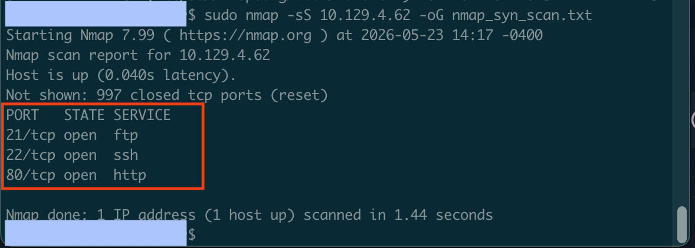

## Step 2: Perform Lightweight Service Validation

Before deep-diving, quickly test FTP behavior:

```bash
nc -nv 10.129.4.62 21
```

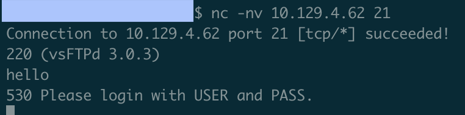

Test anonymous login:

```bash
USER anonymous
PASS
```

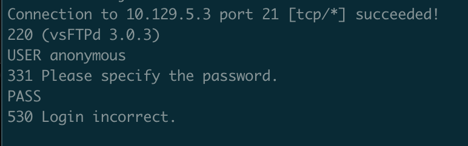

Decision point:
- Anonymous FTP is denied, so avoid spending too much time here and pivot to HTTP, where application vulnerabilities are more likely.

## Step 3: Enumerate the Web Application for Logic Flaws

Open the web application and inspect functionality while proxying through Burp.

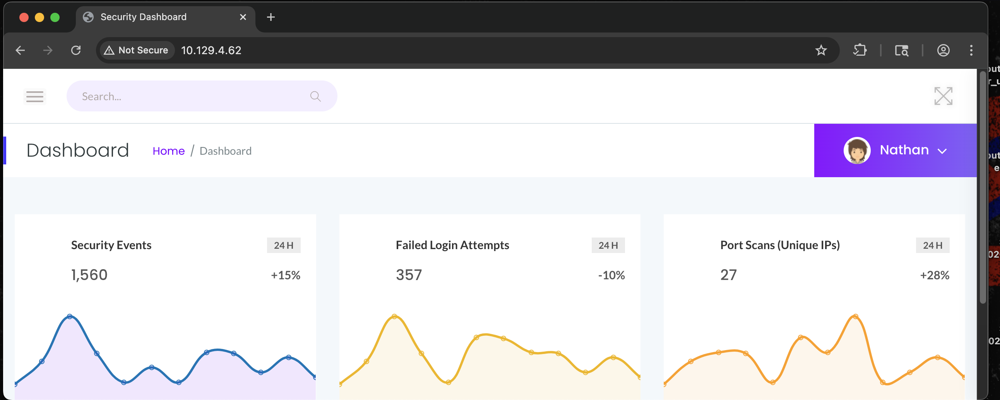

During browsing, note the endpoint pattern `/data/1` associated with security snapshots and downloadable pcap files.

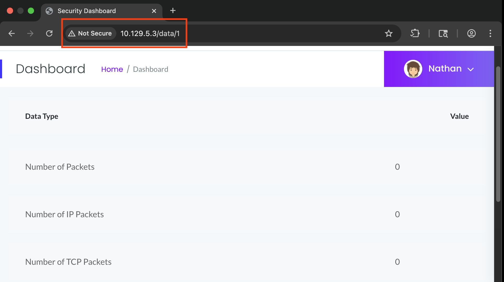

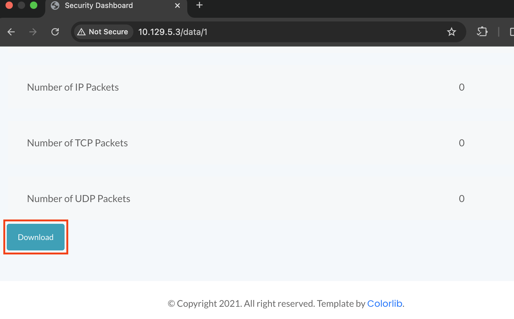

Why this is interesting:
- Numeric direct object references (`/data/<id>`) frequently indicate IDOR opportunities when access control is weak.

## Step 4: Validate IDOR with Controlled Enumeration

Send the request to Burp Intruder and iterate the pcap ID from 0 to 20.

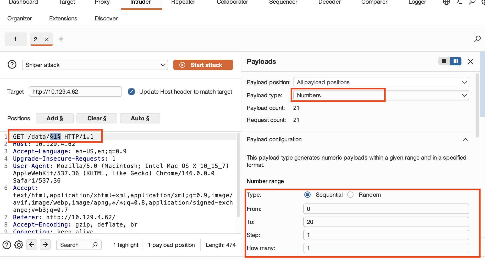

Review responses and identify IDs returning meaningful or different data. ID `0` contains useful content.

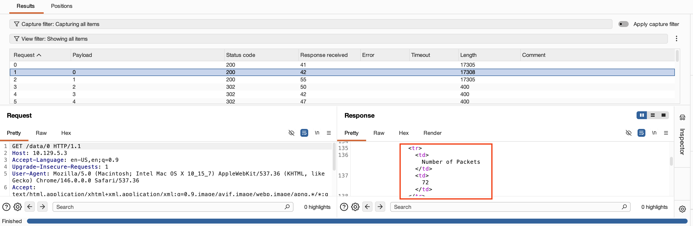

Learning point:
- IDOR confirmation is based on unauthorized object access, not just status code differences.

## Step 5: Extract Credentials from Exposed Data

Download the pcap from ID `0` and inspect it in Wireshark.

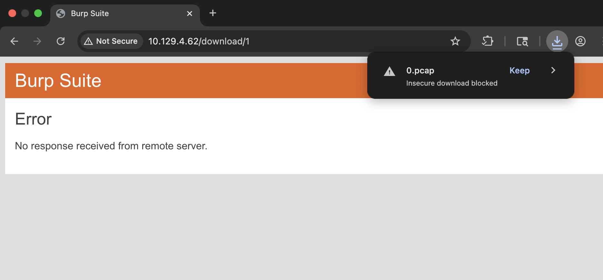

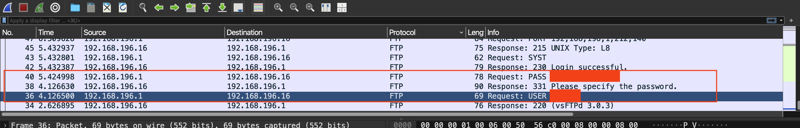

Learning point:
- Plaintext protocols can turn passive capture data into direct credential compromise.

## Step 6: Convert Data Exposure into Host Foothold

Use the recovered credentials in FTP first to validate they are real:

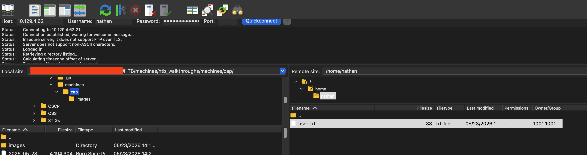

Then test the same credentials against SSH:

```bash
ssh nathan@10.129.4.62
```

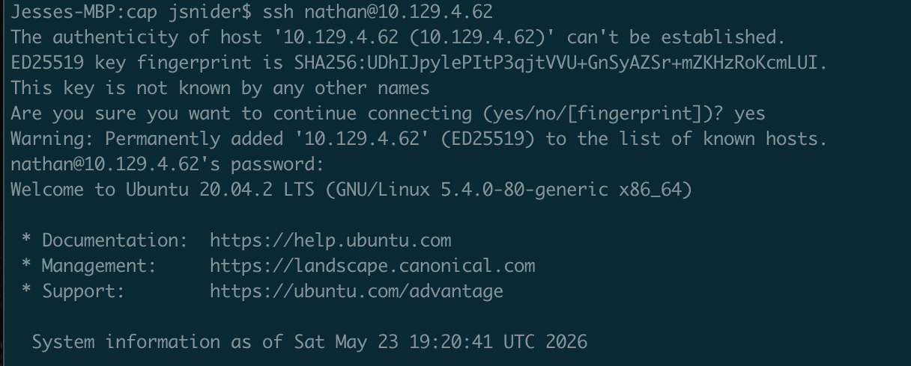

Foothold achieved:
- SSH access as a valid local user provides command execution and full host enumeration capability.

## Step 7: Enumerate Privilege Escalation Paths

Start with standard checks:

```bash
sudo -l
```

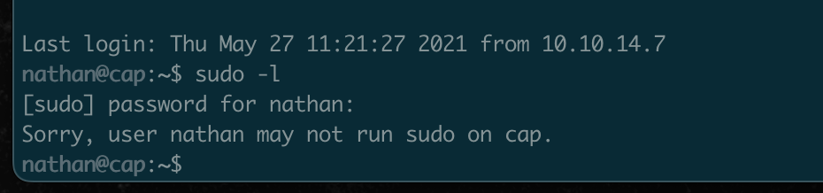

With no sudo route, inspect operational application files for risky privileged behavior:

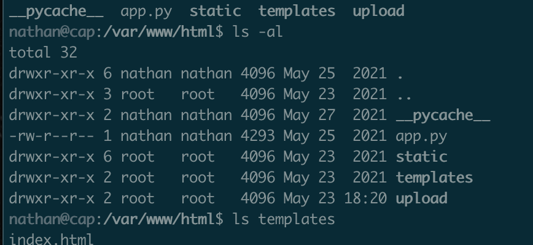

The application code path indicates privileged Python execution related to packet capture.

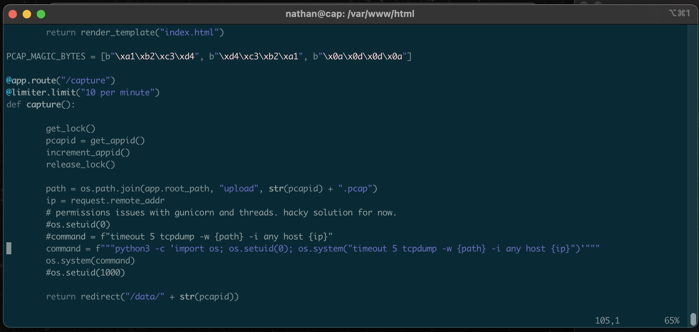

Learning point:
- When common privesc checks fail, pivot to trust boundaries in running app workflows and helper binaries.

## Step 8: Escalate to Root and Verify Access

Use the identified execution path to run a privileged action:

```python
import os; os.setuid(0); os.system('cp /root/root.txt /tmp/root.txt')
```

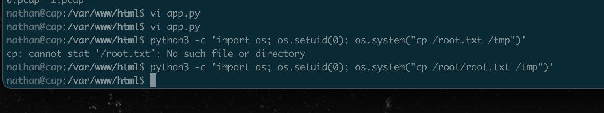

Verify root objective access:

```bash
cat /tmp/root.txt
```

## Final Outcome

This machine was compromised by chaining multiple weaknesses:
- Weak object-level access control in the web layer (IDOR)
- Sensitive data exposure in downloadable packet captures
- Credential reuse across services
- Unsafe privileged execution behavior in the host application path

## Practical Takeaways for Learners

- Treat enumeration as a decision engine, not a checklist.
- Prioritize web attack surface when logic flaws are likely.
- Validate IDOR with evidence of unauthorized data access.
- Always test recovered credentials across all exposed services.
- For host privesc, investigate how the application performs privileged operations.


